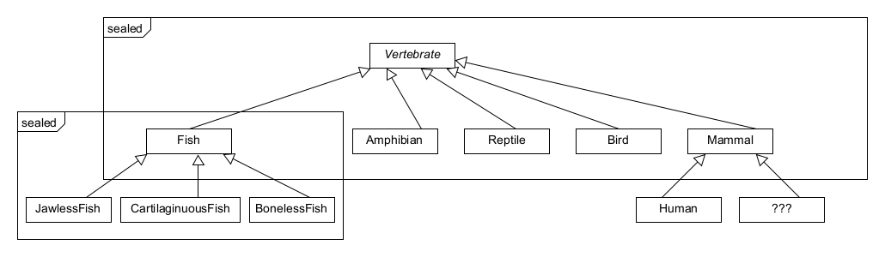

## Labeling the subclass

The compiler forces you to put one of three labels on the direct descendants of a sealed type: `final`,
`sealed`, or `non-sealed`.
They are mutually exclusive.

### final

You should already be familiar with `final` classes.
Adding `final` to a class means that in can't be extended by anything.

### sealed

The descendants of sealed classes can be sealed themselves.
This is a very useful property as it allows you to create complex sealed type hierarchies.

### non-sealed

By declaring a class `non-sealed`, it behaves like an ordinary class that can be extended by
anyone (with the right access).

Hold on – doesn't this jeopardize what we wanted to achieve by using sealed types?

Not at all! Sealed types give us the guarantee that we know its _direct_ descendants at compile time.
We can be sure an instance is at least of one of the subtypes, or the sealed type itself if it
isn't abstract.

### Example

We have added more classes to the `Vertebrate` example.

The following diagram illustrates the sealed and non-sealed inheritance hierarchy.

We made the `Fish` class a sealed class itself.
Let's say we got an instance of `Vertebrate` and narrowed it down to being a `Fish` with `instanceof`.
If we then hand over this `Fish` instance to another method, it knows it can only be a
`JawlessFish`, `CartilaginousFish`, `BonyFish`, or `Fish` (the last one because we didn't make
`Fish` abstract).

We also made `Mammal` a `non-sealed` class.
We have an example `Human` class extending from it, but there could be many more classes extending
`Mammal`, even in different compilation units.
